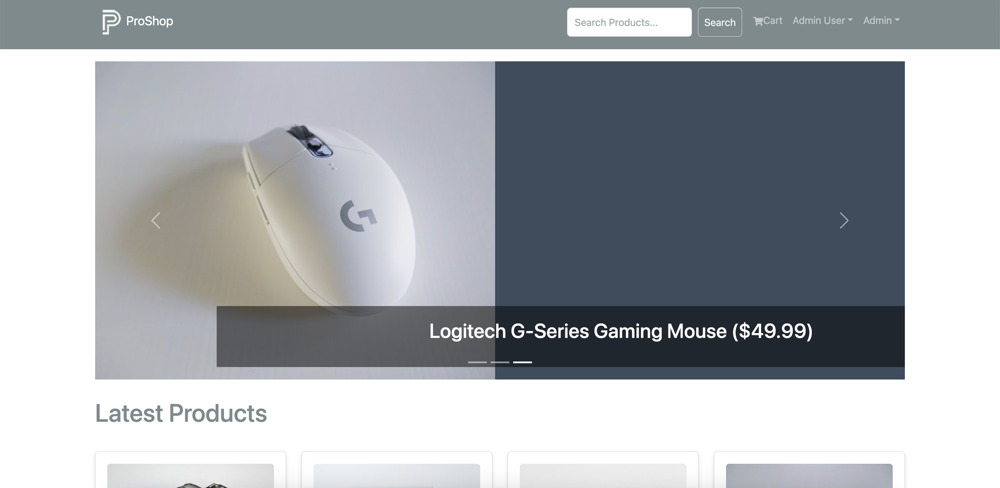
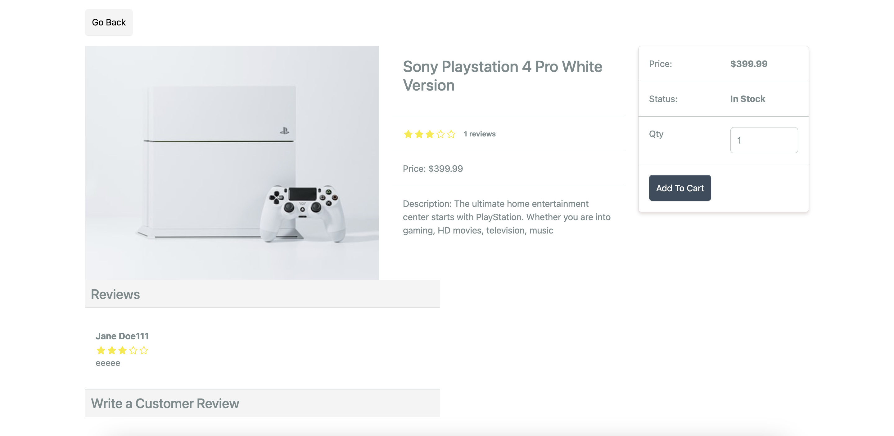
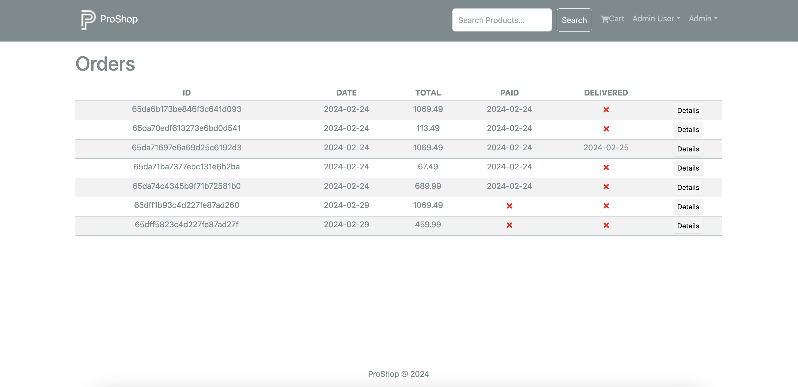

## eCommerce-Platform
This project is built using the MERN (MongoDB, Express.js, React.js, Node.js) stack, providing a comprehensive solution for building a scalable and feature-rich e-commerce platform.

## Features

 - User Authentication: Implemented JWT-based authentication to secure user login and optimize server load.
 - Admin Panel: Built an admin panel for managing products, orders, and user data.
 - Responsive UI: Designed a responsive user interface using Bootstrap, ensuring compatibility across various devices.
 - Payment Integration: Integrated PayPal Checkout APIs to facilitate seamless and secure payment processing.
 - Scalability: Utilized MongoDB for database management, ensuring scalability as the application grows.
